# DHBW_MSA

# Inhaltsverzeichnis
- Ausführung
- Annahmen
- Shift-Cracker Ergänzung
- Datenbank-Struktur
- Commands
    - show algorithm
    - encrypt message "[message]" using [algorithm] and keyfile [filename]
    - decrypt message "[message]" using [algorithm] and keyfile [filename]
    - crack encrypted message "[message]" using [algorithm]
    - register participant [name] with type [normal|intruder]
    - create channel [name] from [participant01] to [participant02]
    - show channel
    - drop channel [name]
    - intrude channel [name] by [participant]
    - send message "[message]" from [participant01] to [participant02] using [algorithm] and keyfile [name]
- Hinzugefügte Commands
    - show participant
    - show postbox [participant]
    - show message
    - help
- Beispielausgaben (Screenshots)

# Ausführung
- **Application.main()**  
führt man die main-Methode in der Klasse Application aus, wird die Methode simulateHSQLDB aufgerufen, hierbei werden die Tabellen der HSQLDB gelöscht und mit den Simulationsdaten bestückt
- **GUI.start()**  
Hierbei wird die GUI gestartet mit Ein- und Ausgabefenster  
**!** sollte diese nicht starten fügen sie als VM options in der Run-Configuration folgendes hinzu:
    > --module-path lib --add-modules=javafx.controls

# Annahme
Der RSA Cracker benötigt für das cracken die **öffentliche Zahl n** und den **öffentlichen Schlüssel e**. Beim Befehl *crack encrypted message* sucht das Programm in den Logs nach der verschlüsselten Nachricht und nimmt aus diesem Log die geloggte Keyfile heraus und übergibt diese dem RSA-Cracker.  
Beim Befehl *intrude channel* wird das MsgEvent abgefangen und die Keyfile von diesem an den Cracker übergeben.

# Shift-Cracker-Ergänzung
Der Shift-Cracker gibt lediglich alle möglichen Zeichenkonstellationen der verschlüsselten Nachricht aus und gibt nicht nur ein Wort mit der größten Wahrscheinlichkeit aus
Somit kam das Problem auf, dass beim Cracken einer Nachricht, welche mit dem Shift-Algorithmus verschlüsselt wurde, die gecrackte Nachricht zu lange (größer 50 Zeichen) für die Datenbank war. Um dieses Problem zu beheben wurde der folgende Shift-Cracker in das Projekt eingepflegt:  
https://stackoverflow.com/a/35241364/11588141  
Mit Hilfe einer Datei, welche englische Wörter beinhaltet sucht dieser aus den gecrackten Varianten die wahrscheinlichste aus und gibt diese dem Programm zurück.  
Verwendete Dictionary-Datei:  
http://quizedia.com/dictionaries/ENG_DICTIONARY.TXT

# Datenbank-Struktur
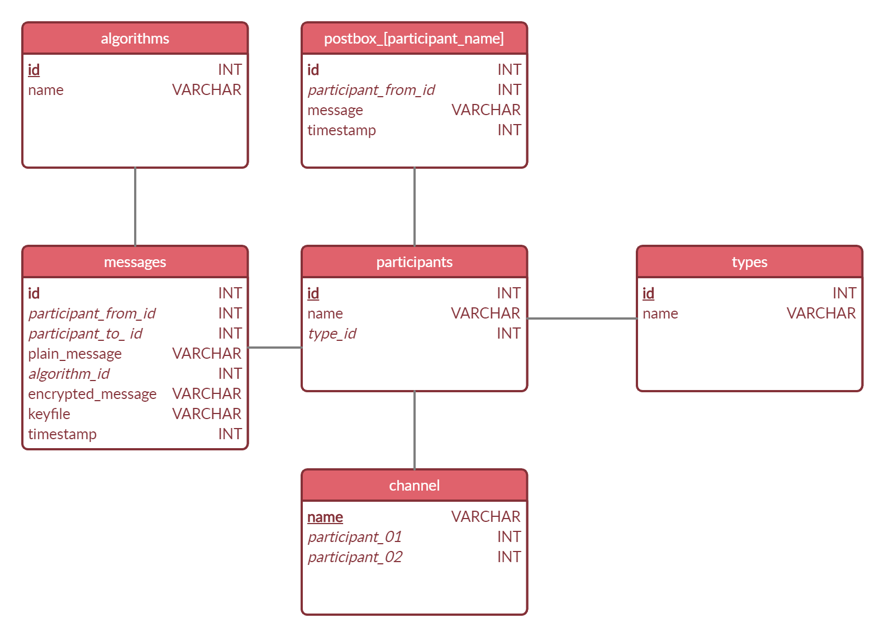

# Commands
## show algorithm
Die in Komponenten gekapselten Algorithmen werden angezeigt. Die Meldung im Ausgabebereich der GUI wird dynamisch aus den Dateinamen der jar im Verzeichnis components ermittelt; *shift | rsa*

## encrypt message "[message]" using [algorithm] and keyfile [filename]
Die zu dem Algorithmus korrespondierende Komponente [algorithm].jar wird dynamisch geladen und die Meldung mit dem key verschlüsselt. Die verschlüsselte Meldung wird im Ausgabebereich der GUI angezeigt.

## decrypt message "[message]" using [algorithm] and keyfile [filename]
Die zu dem Algorithmus korrespondierende Komponente [algorithm].jar wird dynamisch geladen und die Meldung mit dem key entschlüsselt. Die entschlüsselte Meldung wird im Ausgabebereich der GUI angezeigt.

## crack encrypted message "[message]" using [algorithm]
Die zu dem Algorithmus korrespondierende Komponente [algorithm]_cracker.jar wird dynamisch geladen und versucht innerhalb von maximal 30 Sekunden die Meldung zu entschlüsseln. Wurde die Meldung innerhalb der Zeitvorgabe entschlüsselt, wird die entschlüsselte meldung im Ausgabebereich der GUI angezeigt. Wurde die Meldung nicht innerhalb der Zeitvorgabe entschlüsselt, erfolgt die Meldung *"cracking encrypted message "[message]" failed"* im Ausgabebereich der GUI.

## register participant [name] with type [normal|intruder]
Existiert kein Teilnehmer mit diesem Namen wird [i] ein Datensatz in der Tabelle participants und [ii] die Tabelle postbox_[participant_name] angelegt. Im Ausgabebereich der GUI wird die Meldung *"participant [name] with type [normal|intruder] registered and postbox_[participant_name] created"* angezeigt.

Existiert ein Teilnehmer mit diesem Namen wird die Meldung *"participant [name] already exists, using existing postbox_[participant_name]"* im Ausgabebereich der GUI angezeigt.

Für die **Simulation** werden folgende participants angelegt:

| name       | type      |
|------------|-----------|
| branch_hkg | normal    |
| branch_cpt | normal    |
| branch_sfo | normal    |
| branch_syd | normal    |
| branch_wuh | normal    |
| msa        | intruder  |

## create channel [name] from [participant01] to [participant02]
Ein **Channel ist** als **dedizierter EventBus** - basierend auf Google Guava - realisiert.

Für die bidirektionale Kommunikation bzw. das Senden von verschlüsselten Nachrichten zwischen Participant vom Typ normal ist ein Channel notwendig.

Existiert bereits ein Channel mit dem Namen wird die Fehlermeldung *"channel [name] already exists"* im Ausgabebereich der GUI angezeigt. Existiert bereits eine Kommunikationsbeziehung zwischen participant01 und participant02, wird die Fehlermeldung *"communication channel between [participant01] and [participant02] already exists"* im Ausgabebereich der GUI angezeigt.

Sind participant01 und participant02 identisch, wird die Fehlermeldung "[participant01] and [participant02] are identical - cannot create channel on itself"* im Ausgabebereich der GUI angezeigt.

Existiert [i] kein Channel mit dem Namen und [ii] keine Kommunikationsbeziehung zwischen den beiden particpant, wird ein Datensatz in der Tabelle channel angelegt und die Meldung *"channel [name] from [participant01] to [participant02] successfully create"* im Ausgabebereich der GUI angezeigt.

Für die **Simulation** werden folgende channel angelegt:

| channel    | participant01 | participant02 |
|------------|---------------|---------------|
| hkg_wuh    | branch_hkg    | branch_wuh    |
| hkg_cpt    | branch_hkg    | branch_cpt    |
| cpt_syd    | branch_cpt    | branch_syd    |
| syd_sfo    | branch_syd    | branch_sfo    |

## show channel
Im Ausgabebereich der GUI werden die Channel angezeigt.
> *hkg_wuh | branch_hkg and branch_wuh*  
> *hkg_cpt | branch_hkg and branch_cpt*  
> *cpt_syd | branch_cpt and branch_syd*  
> *syd_sfo | branch_syd and branch_sfo*  

## drop channel [name]
Existiert der channel mit dem Namen, wird dieser Datensatz aus der Tabelle channel gelöscht und im Ausgabebereich der GUI die Meldung *"channel [name] deleted"* angezeigt. Existiert kein channel mit dem Namen, wird im Ausgabebereich der GUI die Fehlermeldung *"unknown channel [name]"* ausgegeben.

## intrude channel [name] by [participant]
Existiert der channel mit dem Namen, wird der participant vom Typ intruder für den Channel registriert und erhält alle Nachrichten die über diesen Channel kommuniziert werden.

Bei Erhalt einer Nachricht wird in der Tabelle postbox des Intruders ein neuer Datensatz erstellt, das Attribut message wird auf den Wert unknown gesetzt.

Der participant lädt dynamisch die zu dem Algorithmus korrespondierende Komponente [algorithm]_cracker.jar und versucht innerhalb von maximal 30 Sekunden die Meldung zu entschlüsseln. Wird innerhalbn der Zeitvorgabe die Nachricht erfolgeich entschlüsselt, wird das Attribut message auf den Wert der Meldung im Klartext gesetzt.

Im Fall einer erfolgreichen Entschlüsselung wird im Ausgabebereich der GUI die Meldung *"intruder [name] cracked message from participant [name] | [message]"* gesetzt.

Im Fall einer nicht erfolgreichen Entschlüsselung wird im Ausgabebereich der GUI die Meldung *"intruder [name] | cracked message from participant [name] failed"* angezeigt.

## send message "[message]" from [participant01] to [participant02] using [algorithm] and keyfile [name]
Die Nachricht wird mit dem Algorithmus und keyfile verschlüsselt und von participant01 an participant02 über den Channel kommuniziert.

Existiert zwischen participant01 und participant02 kein channel, wird die Fehlermeldung *"no valid channel from [participant01] to [participant02]"* im Ausgabebereich der GUI angezeigt.

Existiert zwischen participant01 und participant02 ein channel wird die Nachricht mit dem Algorithmus und keyfile verschlüsselt und über den Channel kommuniziert.

Das Versenden der Nachricht wird in der Tabelle messages protokolliert.

Der Empfänger participant02 lädt dynamisch die zu dem Algorithmus korrespondierende Komponente [algorithm].jar und entschlüsselt die Nachricht. Nach Entschlüsselung wird in der Tabelle postbox_[participant02_name] ein Datensatz erstellt und im Ausgabebereich der GUI die Meldung *"[participant02_name] received new message"* angezeigt.

# Hinzugefügte Commands
## show participant
Im Ausgabebereich der GUI werden alle Participants angezeigt.

| ID    | Name       | Type      |
|-------|------------|-----------|
| 1     | branch_hkg | normal    |
| 2     | branch_cpt | normal    |
| 3     | branch_sfo | normal    |
| 4     | branch_syd | normal    |
| 5     | branch_wuh | normal    |
| 6     | msa        | intruder  |

## show postbox [participant]
Im Ausgabebereich der GUI wird die Postbox von [participant] angezeigt.

| ID    | Participant from | Timestamp  | Message  |
|-------|------------------|------------|----------|
| 1     | 5                | 1603032492 | morpheus |

## show message
Im Ausgabebereich der GUI werden alle Messages der Message-Tabelle angezeigt.

| ID    | Participant from | Participant to | Timestamp  | AlgorithmID | Keyfile      | Plain message | Encrypted message |
|-------|------------------|----------------|------------|-------------|--------------|---------------|-------------------|
| 1     | 5                | 1              | 1603032492 | 2           | shift_1.json | morpheus      | pruskhxv          |

## help / ? / command
Im Ausgabebereich der GUI werden alle möglichen Befehle angezeigt

# Beispielausgaben
## show algorithm

## encrypt message "[message]" using [algorithm] and keyfile [filename]
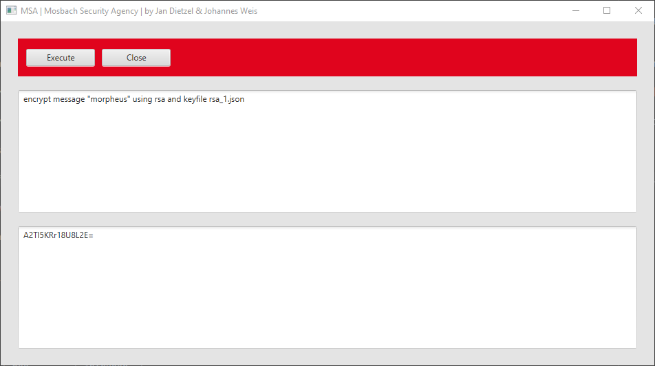
## decrypt message "[message]" using [algorithm] and keyfile [filename]
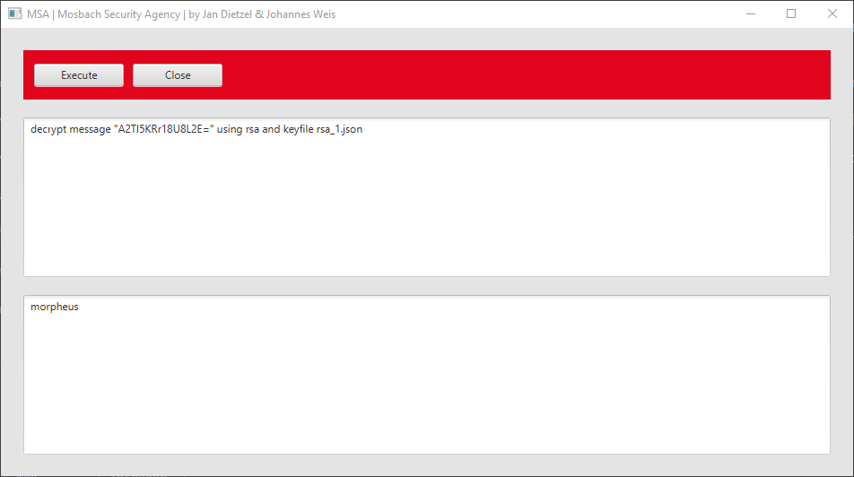
## crack encrypted message "[message]" using [algorithm]
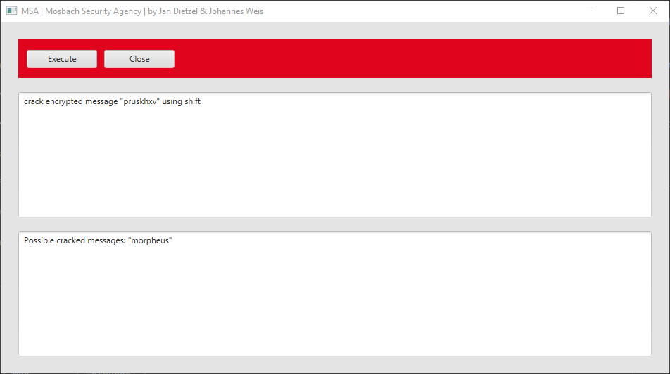
## register participant [name] with type [normal|intruder]
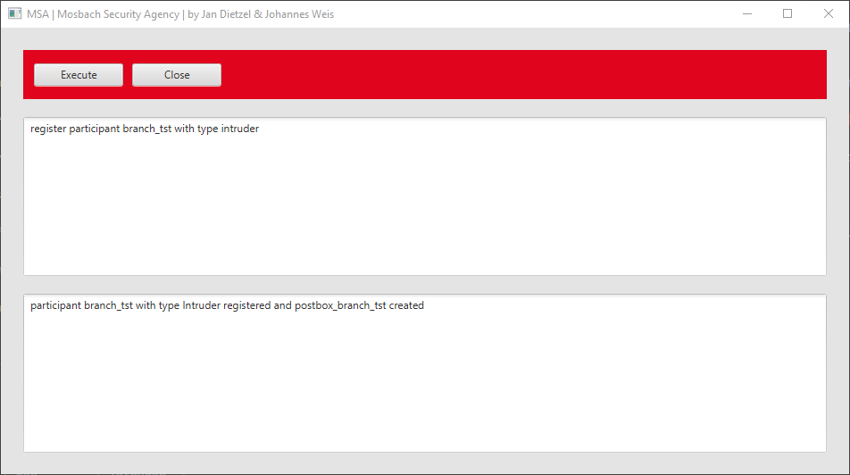
## create channel [name] from [participant01] to [participant02]

## show channel
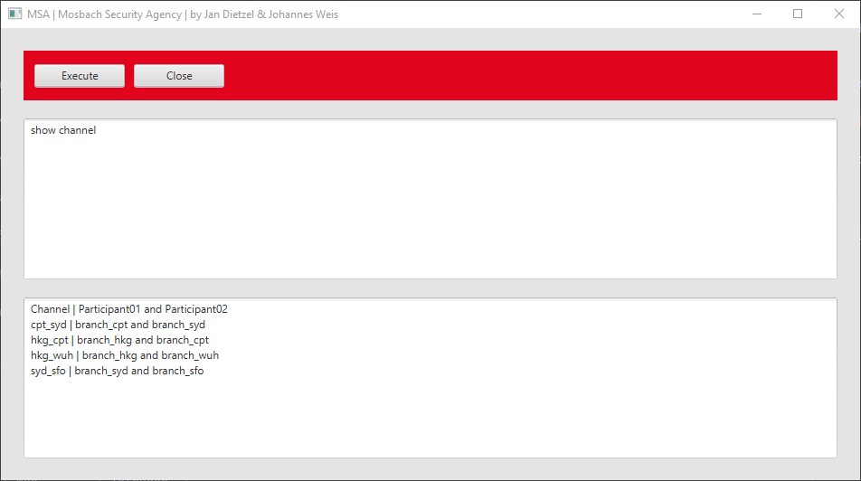
## drop channel [name]
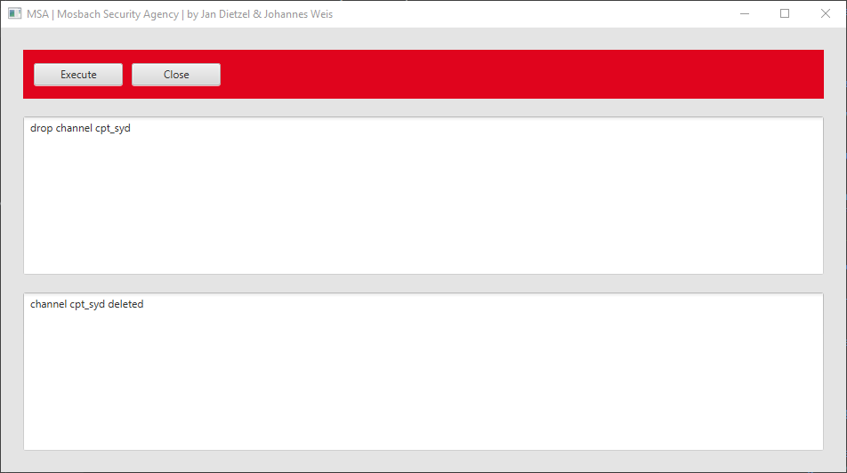
## intrude channel [name] by [participant]
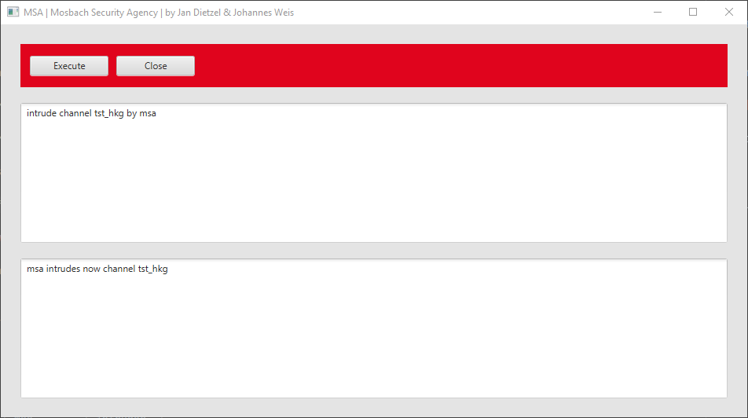
## send message "[message]" from [participant01] to [participant02] using [algorithm] and keyfile [name]
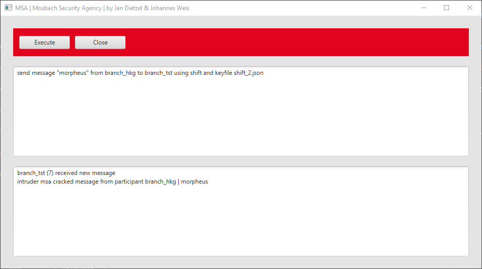
## show participant
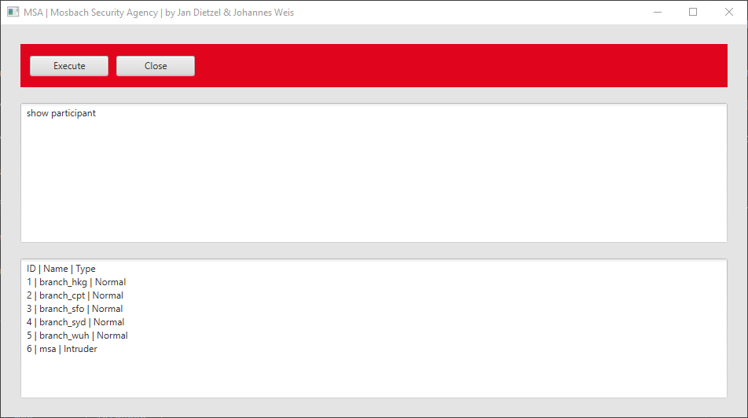
## show postbox [participant]

## show message

## help / ? / command
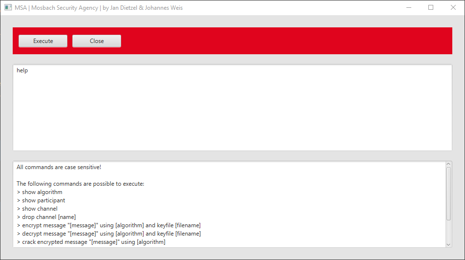